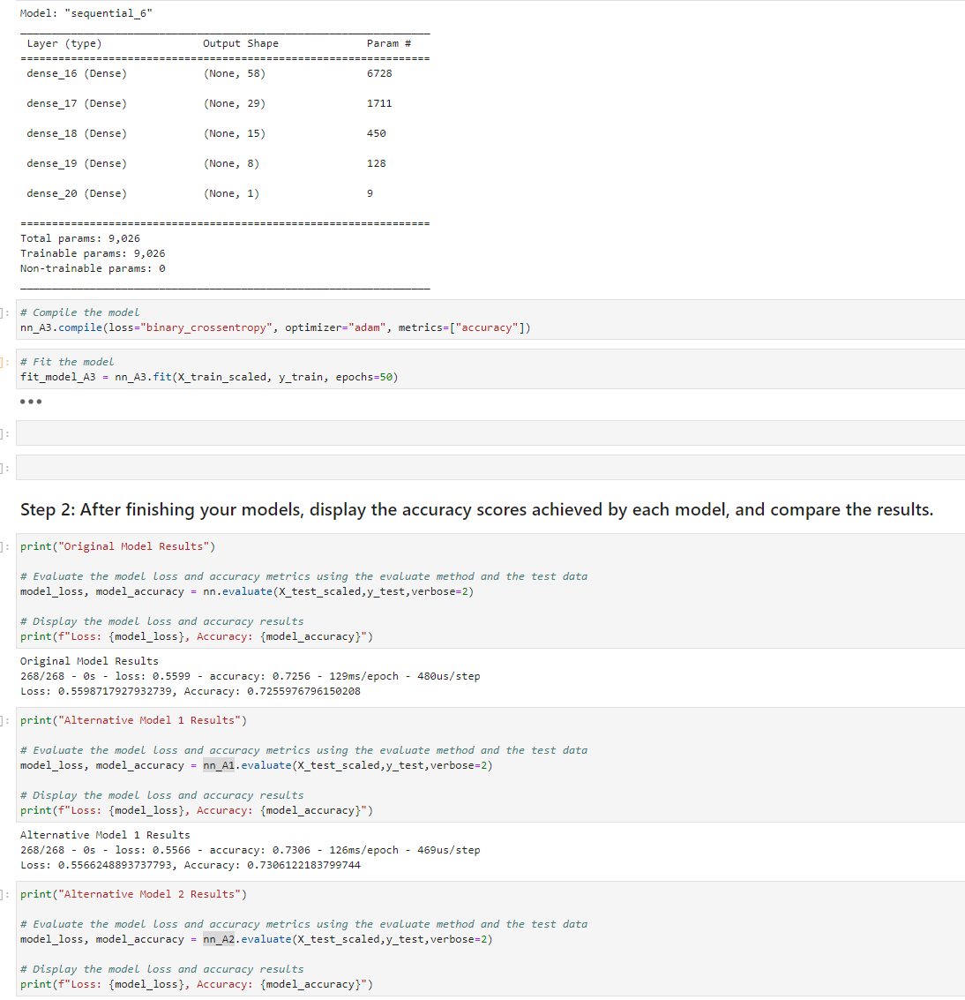

# module_13_challenge

The module 13 challenge for fintech course

The Jupyter Lab file follows along as an exercise to practice building neural networks with the sklearn, tensorflow and keras.

---

## Technologies

The sheet requires Pandas for analyzing data frames in jupyter labs.
It requires Jupyter Labs for a user interface.
It requires Path from pathlib to help read .csv files.
Requires sklearn and tensorflow.

---

## Installation Guide

Other than Python 3.7, the sklearn and tensorflow packages are required, Jupyter Labs runs in a browser, including Chrome.  Launch the file by navigating to the directory of the file through a CLI and then running Jupyter labs, with "jupyter lab".

sklearn and imbalanced-learn can be installed form the CLI with the following:

conda list scikit-learn

pip install --upgrade tensorflow

---

## Usage

The worksheet runs through a scenario and teaches the user to use tensorflow and build/optimize neural networks.

---

## Contributors

Michael Canavan

---

## License

The content of the course is owned and managed by UC Berkeley Fintech Bootcamp.